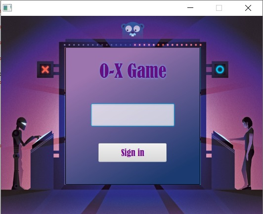
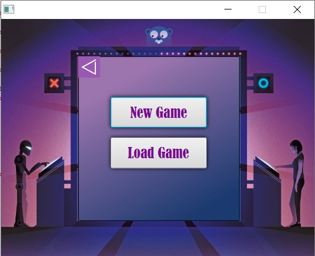
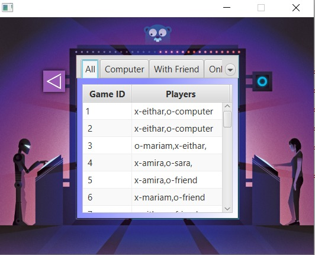
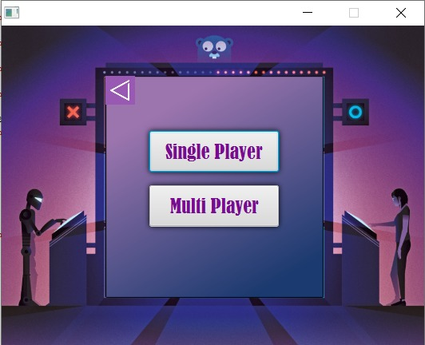
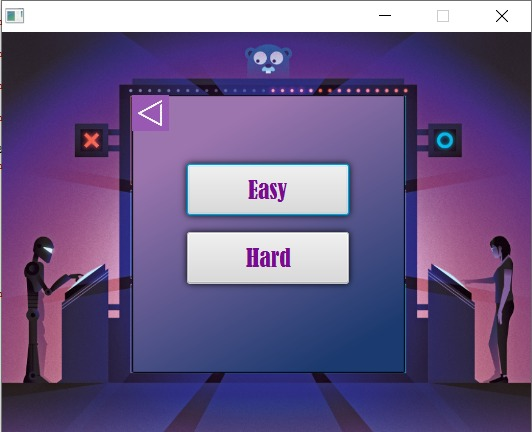
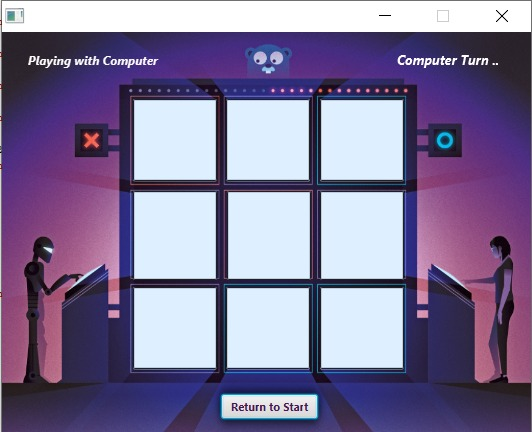
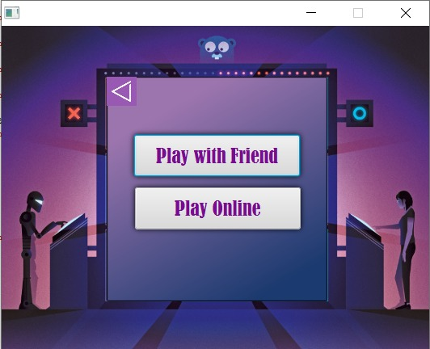
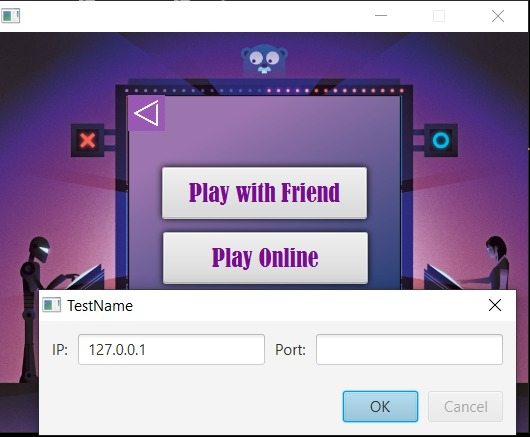
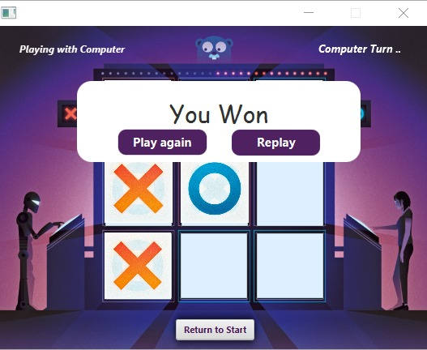

# Tic-Tac-Toe Game 
## Table of Contents
* [Introduction](#introduction)
* [Tools](#tools)
* [Depandancies](#depandancies)
* [Screenshots](#screenshots)

## Introduction
A Tic Tac Toe game which allow you to play either with computer or with your friend, addationaly you are able to view all the history of the played games since you have downloaded it.
There are many scenario in the game:
- Play with your friend localy in your machine.
- Play with your friend online using peer-to-peer Server.
- Play with computer and you have to choice either it is easy game or hard game (unbeatable game using Minimax alogorithm).

## Tools

- NetBeans.
- MySQL Workbench.

## Depandancies
- JavaFX

## Screenshots
You have to Enter your name to Start a game

You are able to play a new game or load a previous game from database.

If you choose load game you have to decide which game to load 

If you choose play a game you have to choose either it with computer or with another player

If you choose single player, decide its hard or easy.

Then the screen will appear to you

If you choose Multi player decide its online or with your friend

If you choose online you have to type the ip and port

Then the screen will appear to you

And if you win, congratulation!

